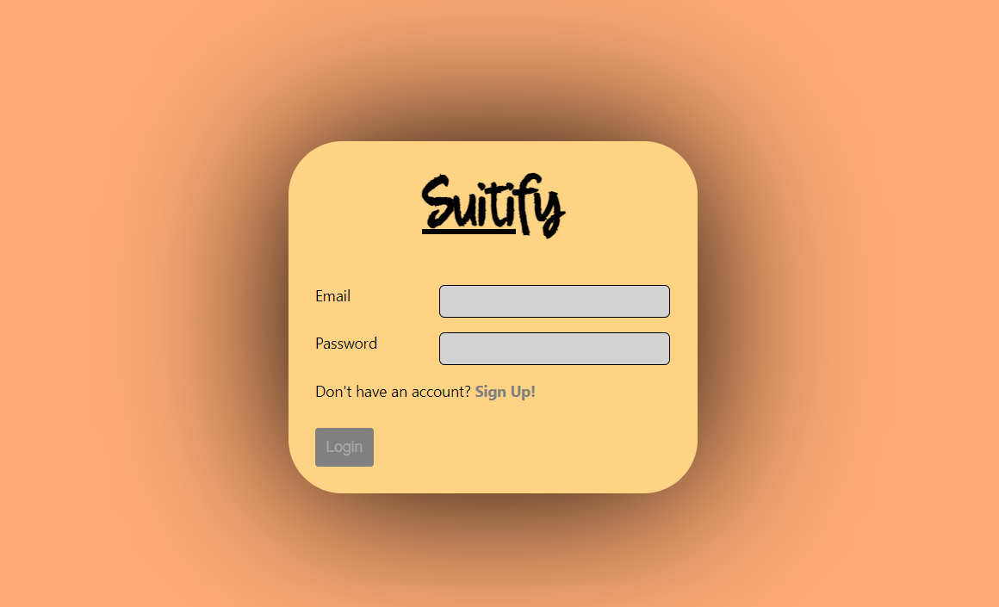

# SUITIFY-REACT-CHAT-APP
## This new Web application is created by Biswarup Bhattacharjee, student of BTECH, of University of Engineering and Management, Kolkata.
## Email Id: bbiswa471@gmail.com. 
## Contact No: 916290272740. 
## About 
It is a real time chatting web application. Messaging apps (a.k.a. "social messaging" or "chat applications") are apps and platforms that enable instant messaging. Here is a sign up or login page to get into the web app. Then we can create chat and start messaging. We can set profile picture also. 
## LINK : https://suitify-react-chat-app.vercel.app/
## Purpose
I have made this application so that I can give it to most of the people I know so that everyone use this and stay connected through online secured messaging.
## Use
First user has to sign up with email id and then after that whenever he enters he has to login. Then user can create chat and message with friends.
## Importance
 It is very safe. No one accept me or the other group member can read messages. Also for the login system no one accept user can read private mesaages.
# suitify-react-chat-app
I have made this using react, firebaseauth,chat engine sdk as rest api etc. It is fully responsive.

 
 

 

 

